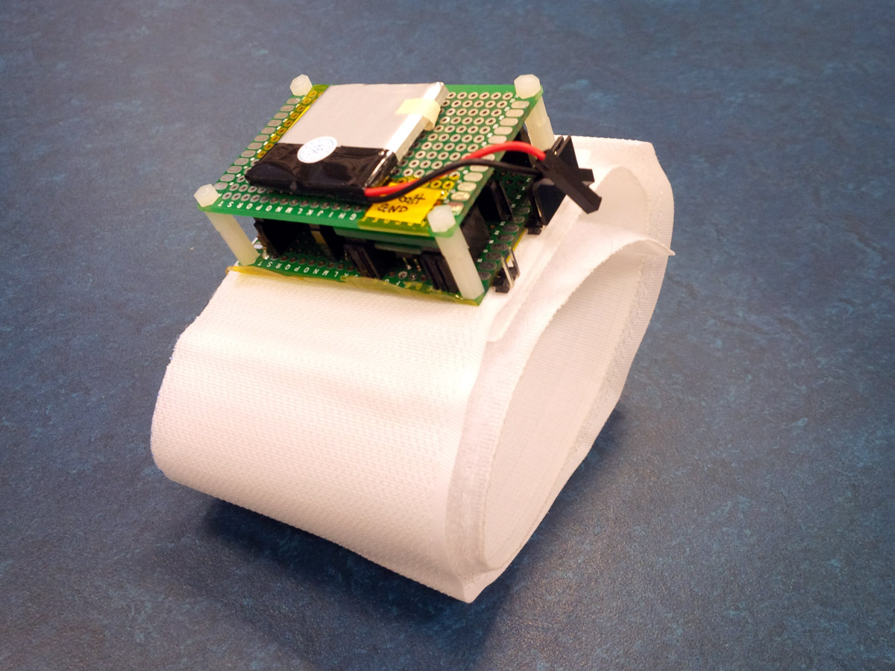

# parkinson-watch
Code related to a monitoring watch for Parkinson disease.
Early prototype:
- 512Mo NAND flash corresponding to 18 days of continuous recording.
- 6 axis (angle rate and acceleration) gyroscope at 26Hz sampling rate + temperature.
- Low power Microchip PIC micro-controller.
- Small 210mA/h battery for more than a day of recording.

First data:

